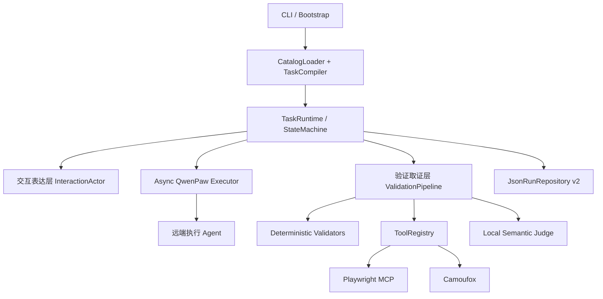

# Agent 用户模拟端执行流程

## 三层架构



交互表达层只接收 CompiledTask、裁剪后的对话和结构化缺口。它生成自然用户话术，不暴露 Criterion ID、工具或内部规则。

任务运行层负责唯一的状态变化、远端会话标识、追问轮数和异常归一化。首轮不计入 guide_rounds；只有成功完成的追问轮才计数。

验证取证层先执行所有确定性检查，再收集工具证据，最后只把剩余语义项交给 Judge。任何异常、缺证据或工具不可用都不会被解释为成功。

## 状态序列

```text
PENDING -> PREPARING -> GENERATING_OPENING -> WAITING_EXECUTOR
        -> VALIDATING -> SUCCESS
        -> GENERATING_FOLLOWUP -> WAITING_EXECUTOR -> ...
```

终态：SUCCESS、GUIDE_EXHAUSTED、INCONCLUSIVE、VALIDATION_ERROR、EXECUTOR_ERROR、ACTOR_ERROR、CANCELLED、INTERRUPTED。

## 验证循环

1. 检查远端最终文本契约。
2. 执行 keyword/format/fields/count/constraint/url validators。
3. 提取 URL、列表项等 Claims。
4. Criterion 声明 capability 时，通过 READY Provider 取证。
5. 剩余语义 Criterion 交给本地 CAMEL Judge。
6. 按 `FAIL > ERROR > INCONCLUSIVE > PASS` 聚合。
7. 只有可改善的 FAIL 进入自然追问；其他状态终止当前 Run。

## 工具生命周期

Provider 由 Registry 并发检查依赖、connect、discover、schema、probe，再统一打印报告。required 非 READY 阻止运行，optional 非 READY 降级；Task 依赖的 capability 不可用时 Criterion 为 INCONCLUSIVE。关闭按 Provider 逆序执行。

## 持久化

每次状态变化写原子 checkpoint 和 append-only event。启动发现非终态记录时标记 INTERRUPTED，不自动恢复外部执行。所有 Run 进入审计数据，只有干净 SUCCESS 对话进入蒸馏集。
