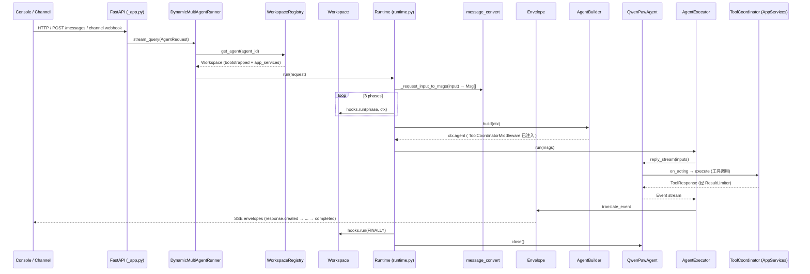

# QwenPaw 后端架构梳理

> useramulation v0.2 客户端契约：使用单一生命周期 `httpx.AsyncClient`；submit 和 poll 始终发送同一 effective execution agent ID。远端当前未运行，本契约由 MockTransport 离线测试覆盖。

> 幂等边界：POST 发送前明确失败时可由上层显式重试；服务端可能已接收但响应结果不明，且接口没有幂等键时，客户端不得自动重复 POST。poll 的临时网络错误允许在整体时限内继续。

> 本文档梳理 QwenPaw 后端（FastAPI + agentscope 2.0）的模块组织、核心抽象与请求交互逻辑。所有路径均相对于仓库根目录 `d:\code\QwenPaw\`，源码主体位于 `src/qwenpaw/`。

---

## 1. 顶层目录与源码布局

```
QwenPaw/
├── src/qwenpaw/              # Python 主包(qwenpaw / copaw)
│   ├── _compat/              # agentscope 1.x → 2.x 兼容层(旧会话反序列化)
│   ├── app/                  # FastAPI 应用、多 agent 托管、channel、cron、MCP
│   ├── agents/               # 智能体实现、工具集合、技能系统、记忆、上下文
│   ├── runtime/              # 8 阶段运行时(Envelope/Builder/Executor/Hook/Prompt)
│   ├── config/               # 配置加载、时区、ContextVars
│   ├── providers/            # LLM Provider 管理 + OpenAI/Anthropic/Gemini/...
│   ├── modes/                # 智能体模式(Coding / Goal / Mission)
│   ├── drivers/              # 多服务驱动系统(MCP/ACP 协议 + 凭据 + 审批)
│   ├── security/             # 工具守卫、技能扫描器、密钥存储
│   ├── governance/           # 审计日志、政策引擎、资源治理
│   ├── hooks/                # 内置生命周期 Hook(session/cron/error/skill-env/...)
│   ├── loop/                 # 停止_handler/门控系统(迭代门、评分门)
│   ├── sandbox/              # 沙箱隔离(Seatbelt / Bubblewrap / Landlock / AppContainer)
│   ├── plugins/              # 第三方插件架构(Manifest/Loader/Registry/API)
│   ├── market/               # Skills Hub / 社区市场(多 provider)
│   ├── cli/                  # CLI 入口(qwenpaw / copaw)与 TUI
│   ├── utils/                # 通用工具(日志、系统信息、启动显示等)
│   ├── console/              # 控制台静态资源(构建产物)
│   ├── agent_stats/          # agent 级统计(从 agents/ 拆出)
│   ├── backup/               # 备份/恢复编排(create/restore/storage/utils)
│   ├── envs/                 # 环境变量持久化(从 app/envs.py 拆出)
│   ├── local_models/         # 本地模型推理(llama.cpp 后端 + 下载管理)
│   ├── services/             # per-workspace 资源边界接口(WorkspaceManager/Sandbox)
│   ├── tauri/                # 桌面端集成(sidecar 入口/CLI 入口/env/guard)
│   ├── tool_calls/           # 工具调用生命周期(ToolCoordinator/Entry/Stream/Limiter)
│   ├── token_usage/          # token 用量统计(buffer/manager/storage/turn)
│   ├── tunnel/               # Cloudflare Quick Tunnel 驱动
│   └── tokenizer/            # tokenizer 资源(merges/vocab/config)
├── console/                  # React + Vite 控制台前端
├── website/                  # 文档站
├── tests/                    # 测试(unit / contract / integration / e2e)
├── scripts/                  # 辅助脚本(channel 合约检查、测试运行等)
└── docs/                     # 补充文档
```

---

## 2. 核心模块职责

### 2.1 `app/` — 网关层与编排宿主

| 路径 | 职责 |
|------|------|
| `app/_app.py` | FastAPI 应用对象与 `lifespan()` 启动/关闭流程；构建 `AppServiceManager`（仅含 `task_tracker` / `tool_coordinator` / `approval_coordinator` 三个跨工作区协调器）、`WorkspaceRegistry`、`ProviderManager`、`LocalModelManager`；拼装内置 hook / mode / tools / slash-cmd；`DynamicMultiAgentRunner` 把每个 HTTP 请求按 agent_id 路由到 `Workspace` 调用 `Runtime.run()`。 |
| `app/_api_action_routes.py` | 扫描 `@api_action` 注解自动生成 HTTP 路由与 slash 命令。 |
| `app/app_services/` | 跨工作区协调器容器目录：`app_service_manager.py`（`AppServiceManager`，严格白名单 3 字段）、`approval_coordinator.py`（HITL 审批协调）、`_builtin_tool_commands.py`（内置工具命令注册）。 |
| `app/multi_agent_manager.py` | agent_id → Workspace 的并发映射：懒加载、热重载、并行启动。被 `WorkspaceRegistry` 继承。 |
| `app/workspace_registry.py` | 继承 `MultiAgentManager`，持有 `app_services` 引用与 `bootstrap_plugins_kwargs`，在每个新建的 `Workspace` 上调用 `bootstrap_plugins(...)` 注入一次性启动参数，并 `set_app_services(app_services)`。 |
| `app/workspace/workspace.py` | 单一 agent 工作区：聚合 `ChannelManager`、`MemoryManager`、`DriverManager`、`CronManager`、`ChatManager`、`WorkspacePlugins`、`LocalWorkspace`、`TaskTracker`、`SafeJSONSession`、`WorkspaceManager`。 |
| `app/workspace/workspace_plugins.py` | 四个 per-workspace 注册表：`HookRegistry`、`SlashCommandRegistry`、`ToolRegistry`、`PromptManager`，外加 `modes: list[AgentMode]`。 |
| `app/workspace/local_workspace.py` | 工具加载入口：`list_tools(...)` 根据 `active_modes / active_skills / enabled_features` 过滤 `ToolDescriptor`，组装 agentscope `Toolkit`。 |
| `app/workspace/service_manager.py` | 统一持有 per-workspace 子组件、用 `ServiceDescriptor` 进行启动/停止编排。 |
| `app/workspace/service_factories.py` | 各子组件(driver_config_watcher / chat_service / channel_service / driver_service / agent_config_watcher)的创建工厂。 |
| `app/chats/` | session/chat 管理层：`manager.py`（`ChatManager`，ChatSpec CRUD，不管理 Redis session）、`models.py`（`ChatSpec`、`SessionSource`）、`session.py`（`SafeJSONSession`，原子写 + 跨平台文件名清洗）、`repo/`、`title_generator.py`、`query_error_dump.py`。 |
| `app/approvals/` | 人工审批服务模块：`service.py`（`ApprovalService`，唯一 pending/completed 审批记录中心，通过 `/daemon approve` 授予）、`models.py`（`ApprovalRequestSummary`）、`display.py`、`driver_gate.py`。 |
| `app/routers/` | REST：agents、chats(runner)、config、providers、skills、skills_stream、workspace、tools、tool_calls、mcp、mcp_oauth、cron、console、auth、files、settings、backup、git、coding-mode、coding-project、agent-scoped、local_models、loops、market、token_usage、envs、fork、voice、agent_stats、agent_status、plugins、provider_oauth、approval、frontend_plugin 等。 |
| `app/routers/agent_scoped.py` | 给 `/api/agents/{agentId}/...` 注入 `AgentContextMiddleware`，从路径参数或 body 解析 `agent_id`。 |
| `app/channels/` | 所有内置 channel(`dingtalk / discord_ / feishu / imessage / matrix / mattermost / mqtt / onebot / qq / sip / slack / telegram / voice / wechat / wecom / xiaoyi / yuanbao / console`)、`BaseChannel`、`ChannelManager`、统一队列、`CommandRegistry`、renderer、access_control、`qrcode_auth_handler`、`schema`。 |
| `app/crons/` | 定时任务 APScheduler 封装：`CronManager`(内置心跳、梦想、@api_action 任务)、`CronExecutor`、`JsonJobRepository`、Models、REST `api.py`。 |
| `app/mcp/` | MCP 配置服务：`config_service.py`、`schemas.py`。 |
| `app/agent_context.py` | `ContextVar` 感知当前请求 agent_id，被 `DynamicMultiAgentRunner` 与 agent-scoped 路由使用。 |
| `app/agent_config_watcher.py` / `driver_config_watcher.py` / `driver_config_service.py` | 文件变更监听，热重载 agent / driver 配置；`driver_config_service` 提供驱动配置服务层。 |
| `app/inbox_store.py` / `inbox_trace_store.py` / `task_tracker.py` / `rate_limiter.py` | 任务 inbox、trace、在流任务计数、速率限制。 |
| `app/auth.py` / `app/routers/auth.py` | 认证中间件与 token 路由。 |
| `app/migration.py` | legacy workspace/skill 迁移。 |
| `app/utils.py` | app 层通用工具。 |

### 2.2 `runtime/` — 8 阶段运行时

| 路径 | 职责 |
|------|------|
| `runtime/phases.py` | 阶段枚举：`PRE_DISPATCH / POST_DISPATCH / PRE_AGENT_BUILD / POST_AGENT_BUILD / PRE_EXECUTE / POST_RESPONSE / ON_ERROR / FINALLY`。 |
| `runtime/runtime.py` | 主循环 `Runtime.run()`：归一化请求、构建 `HookContext`，创建 `Envelope`，按 8 阶段驱动 `HookRegistry`，固定 1 = slash dispatch，固定 2 = `AgentBuilder.build`，固定 3 = `AgentExecutor.run`；异常时走 `ON_ERROR` → `FINALLY` → `agent.close()`。 |
| `runtime/builder.py` | `AgentBuilder.build_toolkit(...)` 拉取 per-workspace `list_tools`、拼接 memory_tools（包 `PolicyGuardedTool`）和 skill_dirs；`build(ctx)` 组装最终 `QwenPawAgent`。 |
| `runtime/executor.py` | `AgentExecutor.run(msgs)` 调用 `agent.reply_stream(inputs=msgs)`，用 `_iter_with_heartbeat` 包裹后通过 `Envelope.translate_event` 转为 SSE。 |
| `runtime/envelope.py` | SSE envelope 状态机：维护 text/reasoning/tool/data 块，生成 `AgentResponse / Message / TextContent / DataContent` 序列(含 `response.created`、`heartbeat`、`cancel`、`error` 终态)。 |
| `runtime/heartbeat.py` | 心跳 tick 注入：长 idle(如工具守卫等待)期间发 keep-alive envelope 防连接中断。 |
| `runtime/hooks.py` | Hook 抽象：`HookAction(CONTINUE / SHORT_CIRCUIT / SKIP_AGENT)`、`HookResult`、`HookContext`、`HookBase`、`HookRegistry`。 |
| `runtime/message_convert.py` | `AgentRequest.input`(1.x Message 列表) → agentscope 2.0 `Msg` 转换；把text/image/audio/video/file 内容块映射到 `TextBlock` / `DataBlock(URLSource)`，处理本地路径 `file://` 协议与 MIME 推断。 |
| `runtime/_state_utils.py` | `StateProxy`：满足 `SafeJSONSession` state_module 协议的最小代理，供 session hook 与内置命令在无完整 agent 时 load/save `AgentState`。 |
| `runtime/builtin_commands.py` | 内置 slash 命令：daemon、control、conversation 等。 |
| `runtime/slash_command_registry.py` | 注册 / 匹配 `/xxx` 命令。 |
| `runtime/tool_registry.py` | `ToolDescriptor`/`ToolRegistry`：声明 `requires_modes / requires_skills / requires_features / requires_sandbox`，`filter()` 被选入当前请求的工具。 |
| `runtime/prompt_manager.py` / `prompt_contributors.py` | 系统提示词组装：`PromptContributor` 按 priority 排序后拼接。 |
| `runtime/tool_guard.py` | 运行时工具守卫包装（通常与 policy 结合）。 |
| `runtime/commands/` | 控制类命令：`control/`、`daemon.py`。 |

### 2.3 `agents/` — 智能体核心

| 路径 | 职责 |
|------|------|
| `agents/react_agent.py` | `QwenPawAgent`：继承 agentscope `Agent`（+ `CodingModeMixin`）；完全由构造注入 `model / system_prompt / toolkit / middlewares / agent_config / memory_manager / context_manager / governor`；提供 `reply_stream()` 给 executor 使用。 |
| `agents/prompt.py` / `prompt_builder.py` / `templates.py` | 系统提示词模板与构建。 |
| `agents/middlewares.py` | agentscope middleware（包装单次 reply loop，与 runtime hook 正交）。 |
| `agents/model_factory.py` | 按 `AgentProfileConfig` 构造 `ChatModelBase`。 |
| `agents/context/` | 滚动/上下文压缩策略（scroll、compaction）。 |
| `agents/memory/` | 长期 memory 后端(Reme Light / ADBPG / dummy)与主动响应器。 |
| `agents/skills/` | 内置技能目录（每个含 `SKILL.md`）。 |
| `agents/skill_system/` | 技能池 + 工作区技能发现、清单 reconciliation、`resolve_effective_skills()`、`SkillService`、`SkillPoolService`。 |
| `agents/command_handler.py` | chat 内命令处理（含 1.x 历史回放：调 `_compat/message.py:msg_from_dict` 反序列化旧会话）。 |
| `agents/routing_chat_model.py` / `offloader.py` | 模型路由与卸载。 |
| `agents/acp/` | ACP 客户端/元数据。 |
| `agents/tools/` | 内置工具函数集合，统一被 `@tool_descriptor` 装饰，由 `discover_builtin_tool_funcs()` 汇总。 |
| `agents/utils/` | agents 层通用工具。 |
| `agents/hooks/` | agent 钩子。 |
| `agents/md_files/` | Markdown 技能文档。 |

**内置工具清单 (`agents/tools/`)**：`shell.py`、`file_io.py`、`file_search.py`、`ast_tool.py`、`lsp_tool.py`、`_lsp_client.py`、`_lsp_servers.py`、`browser_control.py`、`browser_snapshot.py`、`desktop_screenshot.py`、`view_media.py`、`web_search.py`、`send_file.py`、`agent_management.py`、`delegate_external_agent.py`、`run_tool_batch.py`、`get_current_time.py`、`get_token_usage.py`、`make_skill_tools.py`、`utils.py` 等。

### 2.4 `channels/` — 渠道接入层

`BaseChannel`（ABC）约定规范：
- 类属性 `channel: str`（全局唯一，如 `"dingtalk"`、`"console"`）。
- 入口：`consume_one(request)`（`AgentRequest` 输入，流式产出 `Event`）。
- 本地协议：原生 payload → `content_parts`（`TextContent / ImageContent / FileContent / ...`）。
- 可选：`_is_native_payload`、`_consume_one_request`、`merge_native_items`、`merge_requests`、`build_message`、`send_message`、`enqueue`。

`ChannelManager` 负责：
- 维护每个 channel 的队列（`UnifiedQueueManager`，每通道最大 1000）。
- 批量合并（如同一个钉钉 webhook 的多条消息后合并后 `_consume_one_request`）。
- 注册 `CommandRegistry`，把 slash 命令(` /xxx `)路由到统一 dispatch。

channel 类型注册表：`app/channels/registry.py`（内置 + `custom_channels/`）。每个含独立子目录（`dingtalk/`、`telegram/` 等）+ 可能的独立 `console/` 子目录。

### 2.5 `providers/` — LLM Provider 层

- **抽象**：`provider.py` 定义 `Provider`、`ProviderInfo`、`ModelInfo`、`BaseProvider`-风格接口。
- **编排**：`provider_manager.py` 持有 OpenAI / Anthropic / DashScope / Gemini / OpenRouter / LM Studio / Ollama / OpenAIResponse 等 provider（现每个 provider 为独立模块文件：`openai_provider.py`、`anthropic_provider.py`、`dashscope_provider.py`、`gemini_provider.py`、`ollama_provider.py`、`lmstudio_provider.py`、`openrouter_provider.py`、`openai_response_provider.py`），提供模型列表、能力基线、本地模型恢复。
- **能力探活**：`capability_baseline.py`、`model_capability_cache.py`、`multimodal_prober.py`、`context_windows.py`。
- **辅助**：`retry_chat_model.py`、`capping_formatter.py`、`openai_chat_model_compat.py`、`rate_limiter.py`、`oauth/`。

### 2.6 `modes/` — 智能体行为模式

`AgentMode` 抽象：
- bundle 式：commands / tools / hooks / prompt_contributors 在 `setup(workspace)` 中一次性注入。
- 运行时由 `is_active(ctx)` 判断当前请求是否命中；`ModeGatedHook` 自动跳过未激活 mode 的 hook。

内置实现：
- `modes/coding/`：`CodingMode` + `CodingModeMixin`（LSP/AST/内联 diff / coding-project）。
- `modes/goal/`：`GoalOpenAI-风格 goal-tracking`。
- `modes/mission/`：`MissionMode`。

### 2.7 `drivers/` — 多服务驱动(MCP/ACP)

协议无关的核心框架：
- **contracts**：`DriverCard`、凭证引用、验证。
- **handler**：`handler.py`（`DriverHandler` 抽象）+ `handlers/`（`mcp.py`、`mcp_stateful_client.py`）。
- **manager**：`DriverManager` 管理卡片目录、凭据、审批门、调用派发；由 `app/mcp/` 桥接配置与注册。
- **credentials**：`credentials/` 异步凭据存储(provider/store/bindings/types)+ 多 provider 凭据适配。
- **policy / approval / capabilities / storage / time / errors**：驱动能力声明、策略引擎、审批门、卡片持久化、时间戳、错误层次(`policy_types.py`)。
- **adapters**：具体协议适配器（`agentscope_tool.py`、`mcp_binding.py`、`mcp_card_builder.py`、`mcp_console.py`、`mcp_legacy_config.py`）。

### 2.8 `security/` — 安全层

- `secret_store.py`：凭据加密/解密、密钥目录。
- `skill_scanner/`：静态扫描 `SKILL.md` 的危险模式。
- `tool_guard/`：调用前扫描（防命令注入、数据外泄、敏感文件访问）：
  - `BaseToolGuardian` 抽象
  - `RuleBasedToolGuardian`（YAML 正则签名）
  - `FilePathToolGuardian`
  - `ToolGuardEngine` 聚合多 guardian → `ToolGuardResult`

### 2.9 `governance/` — 运行时治理

- `audit.py`：审计日志。
- `detectors.py` + `generalize.py`：异常检测与泛化。
- `policy.py` + `tool_adapter.py` + `tool_registry.py`：政策包装工具（`PolicyGuardedTool`）、 sandbox 需求检查。
- `resource_governor.py`：资源限制(并发、token、循环等)。

### 2.10 `hooks/` — 内置生命周期 Hook

- `base.py`、`bootstrap/`、`cron/`、`error/`、`observability/`、`request_setup/`、`session/`、`skill_env/`。
- 启动时由 `workspace_registry._bootstrap_kwargs["builtin_hook_clses"]` 一次性注册到每个 workspace（见 `app/_app.py`）。典型：
  - `SessionLoadHook` / `SessionSaveHook`
  - `CronContextHook` / `CronMemoryIsolateHook` / `CronMemoryRestoreHook`
  - `BootstrapHook` / `SkillEnvHook` / `SkillEnvCleanupHook`
  - `ContextVarsSetupHook` / `MediaProcessHook`
  - `ErrorNormalizeHook` / `CancelCleanupHook`
  - (可选)`LangfuseTraceHook` / `LangfuseTraceCleanupHook`

### 2.11 `loop/` — 停止/门控

- `handler_registry.py` + `react_gates.py` + `gates/`：门控与循环中止（doom-loop guard、iteration gate、rubric gate）。

### 2.12 `sandbox/` — 沙箱隔离

跨平台：`Seatbelt`(macOS)、`Bubblewrap / Landlock`(Linux)、`AppContainer`(Windows)、`NONE`。`config.py` 提供能力探测（`probe_sandbox_support` 按平台探测）、模式自动检测（`detect_platform_mode`）和工厂（`create_sandbox`）；工具通过 `requires_sandbox` 声明沙箱需求，由 `governance.tool_adapter.PolicyGuardedTool`（`check_permissions` + sandbox 执行/违规重试循环）在调用前校验。

### 2.13 `plugins/` — 第三方插件架构

- **架构层**：`architecture.py`（`PluginType` 枚举：`TOOL / PROVIDER / HOOK / COMMAND / CHANNEL / FRONTEND / GENERAL`；`PluginManifest` Pydantic 模型，校验 `plugin.json` 并做 legacy 兼容；`PluginRecord`、`QwenPawVersionConstraint`）。
- **加载/注册**：`loader.py`（`PluginLoader`）、`registry.py`（`PluginRegistry`）、`runtime.py`（`RuntimeHelpers`）。
- **API/校验/安装**：`api.py`（给插件开发者的便捷函数，如 `get_tool_config`）、`validation.py`、`download_catalog.py`、`install_lock.py`。
- 插件注册内容：控制命令、provider、HTTP 子应用、startup/shutdown hook、prompt 贡献者、frontend JS bundle。

### 2.14 `market/` — Skills Hub / 社区市场

`service.py`（市场搜索 + provider 列表）+ `providers/`（`base.py` + `aliyun` / `clawhub` / `modelscope` / `qwenpaw` 多 provider）+ `categories.py` + `schema.py`（`MarketResult`、`ProviderInfo`）。支持列表、安装、发布 `agents/skills` 市场项。

### 2.15 `cli/` — CLI 与 TUI

`qwenpaw.cli.main:cli` → `qwenpaw` / `copaw` 命令；`cli/tui/` 基于 Textual 的交互终端（裸命令默认进入 TUI）；`cli/` 下含 `agents_cmd`、`channels_cmd`、`chats_cmd`、`cron_cmd`、`skills_cmd`、`providers_cmd`、`task_cmd`、`mission_cmd`、`desktop_cmd`、`daemon_cmd`、`env_cmd`、`clean_cmd`、`app_cmd`、`init_cmd`、`shutdown_cmd`、`auth_cmd`、`plugin_commands`、`doctor_cmd` 等子命令 + `auto.py`（浏览器自动化）+ `http.py` + `process_utils.py` + `doctor_*`。

### 2.16 `config/` — 配置

- `config.py`：`Config` / `AgentProfileConfig` / `AgentsRunningConfig` / `ModelSlotConfig` / `ACPAgentConfig` / `SkillConfig` / ACP agents 等 Pydantic 模型。
- `utils.py`：配置路径、读写。
- `timezone.py`：系统时区检测与归一化。
- `context.py`：context var 键（由 `ContextVars.py` 改名）。

### 2.17 新增顶层模块（v2.0 重构拆出）

| 模块 | 职责 |
|------|------|
| `_compat/` | agentscope 1.x → 2.x 兼容层。`message.py` 提供 `msg_from_dict` 反序列化旧会话 JSON（`timestamp`→`created_at`、旧 per-modality block → `DataBlock/ToolCallBlock`），供 `agents/command_handler.py` 加载历史；一旦磁盘会话全部升级为 2.0 格式即可删除。 |
| `agent_stats/` | agent 级统计（从 `agents/` 拆出）：`models.py`、`service.py`。 |
| `backup/` | 备份/恢复编排（从 `app/` 拆出）：`orchestration.py`（顶层 `execute_restore`：stop agents → restore → restart）、`_ops/`（`create.py`、`restore.py`、`storage.py` + helpers）、`_utils/`（`_mount_swap`、`safe_swap`、`meta`、`signing`、`constants`）、`models.py`（`BackupMeta`、`RestoreBackupRequest`）。 |
| `envs/` | 环境变量持久化（从 `app/envs.py` 拆出）：`store.py` 提供 `load_envs` / `save_envs` / `set_env_var` / `delete_env_var` / `load_envs_into_environ`。 |
| `local_models/` | 本地模型推理（从 `providers/local_models/` 拆出）：`manager.py`（`LocalModelManager` 单例 facade，管理 llama.cpp 下载与服务器控制）、`model_manager.py`（`ModelManager` + `DownloadSource` 推荐模型）、`llamacpp.py`（`LlamaCppBackend` 启动/设置）、`download_manager.py`、`tag_parser.py`。 |
| `services/` | per-workspace 资源边界 **接口契约层**（具体实现由单独 workstream 提供，当前为 stub）：`workspace_manager/workspace_manager.py`（`WorkspaceManager`，持有 `working_dir` + `Sandbox`，`start/stop` 生命周期）、`workspace_manager/sandbox.py`（`Sandbox` 抽象 + `SandboxViolationError`，`check_path`/`check_tool` 抛 `NotImplementedError`）。**尚未接入 `Workspace`，仅定义接口契约。** |
| `tauri/` | 桌面端集成：`entry.py`（Tauri sidecar 启动 Python 后端，含 frozen 检测、bundled Python 处理）、`cli_entry.py`（PyInstaller 打包入口 `mp.freeze_support()` + `cli()`）、`env.py`（desktop AppContainer / CORS 环境变量）、`backend_guard.py`、`sidecar_logging.py`。 |
| `tool_calls/` | 工具调用 **全生命周期** 管理（核心新模块）：`_coordinator.py`（`ToolCoordinator`，唯一 owner 所有 in-flight 工具调用状态；execute 路径带锁、读路径无锁）、`_entry.py`（`ToolCallEntry` + `ToolCallStatus: running/offloaded/completed`）、`_context.py`（`ToolCallContext` + `CancelReason` + `OffloadReason`）、`_stream.py`（`ToolStream`）、`_hooks.py`（`ToolHookRegistry`）、`_result_limiter.py`（`ToolResultLimiter`，限制工具结果体量）、`_middleware.py`（`ToolCoordinatorMiddleware`，agentscope `MiddlewareBase` `on_acting` 代理给 ToolCoordinator）、`_timeout_helper.py`（`cancellable_wait` / `effective_timeout`）、`_ctxvars.py`（ContextVar 读写）、`_hint.py`（offload hint 消息）。导出为跨工作区 `AppServiceManager.tool_coordinator`。 |
| `token_usage/` | token 用量统计（从子模块提升）：`manager.py`（`TokenUsageManager`）、`buffer.py`、`model_wrapper.py`、`storage.py`、`turn_usage.py`。 |
| `tunnel/` | `cloudflare.py`（Cloudflare Quick Tunnel 驱动，运行 `cloudflared tunnel --url` 暴露 `*.trycloudflare.com`）+ `binary_manager.py`（cloudflared 二进制管理）。 |
| `tokenizer/` | tokenizer 资源：`merges.txt`、`tokenizer.json`、`vocab.json`、`tokenizer_config.json`。 |

### 2.18 其他

- `observability/`：`langfuse.py` 等可观测导出。
- `console_push_store.py`、`api_action.py`：控制台推送存储、`@api_action` 注解 + `ManagerRegistry` 自动路由。
- `utils/`：`command_runner.py`、`console_static.py`、`http.py`、`json_utils.py`、`logging.py`、`model_response.py`、`port.py`、`startup_display.py`、`stdio.py`、`system_info.py`、`telemetry.py`。

---

## 3. 请求交互逻辑：完整的端到端生命周期

### 3.1 入口

1. **HTTP**：`FastAPI` 挂载在 `app/_app.py` → `app = FastAPI(lifespan=lifespan)`。
2. **路由**：每个请求经 `AgentContextMiddleware`（注入 `agent_id`）→ `AuthMiddleware` 鉴权 → 命中具体 router。
3. **核心 chat 请求**：由 `app/routers/` 中 runner 或 `messages.py` 转发到 `DynamicMultiAgentRunner.stream_query(request)`。

### 3.2 `DynamicMultiAgentRunner.stream_query`

- 从 `get_current_agent_id()` 拿 agent_id → `WorkspaceRegistry.get_agent(agent_id)` 拿/建 Workspace。
- 注册 `TaskTracker`（用于优雅停机时感知在飞任务）。
- 构造 `Runtime(workspace, app_services)` → `async for ev in rt.run(request): yield ev`。

### 3.3 `Runtime.run()` — 8 阶段编排

```
Runtime.run(request)
│
├─[PRE_DISPATCH]   hook_registry.run(PRE_DISPATCH, ctx)
│                  → SHORT_CIRCUIT? 发 payload, return
│                  → SKIP_AGENT?    skip_agent=True
│
├─[固定 1] slash dispatch
│   text = last_user_text(ctx.input_msgs)
│   cmd = slash_command_registry.dispatch(text, ctx)
│   若匹配 → 从 envelope 发结果, skip_agent=True
│
├─(若未 skip)[POST_DISPATCH] hooks
│
├─[PRE_AGENT_BUILD] hooks(session.load、context 等)
│
├─[固定 2] AgentBuilder.build(ctx)
│   → ctx.agent = QwenPawAgent(...)
│
├─[POST_AGENT_BUILD] hooks(注入模式上下文)
│
├─[PRE_EXECUTE] hooks(bootstrap / prompt / skill-env push)
│   → SHORT_CIRCUIT / SKIP_AGENT 检测
│
├─[固定 3] _apply_context_injections(ctx)
│           AgentExecutor(ctx.agent, envelope).run(ctx.input_msgs)
│             agent.reply_stream(inputs=msgs)
│               → _iter_with_heartbeat 包裹
│               → Envelope.translate_event(event) → yield SSE
│
├─[POST_RESPONSE] hooks(session.save / cron writeback)
│
├─ envelope.finalize() → 完成 message + response
│
├─ 异常 → [ON_ERROR] hooks → error_envelope / cancel_envelope
│
└─ [FINALLY] hooks(关闭 MCP、reset ContextVars) + agent.close()
```

### 3.4 SSE Envelope 状态机（`runtime/envelope.py`）

- 初始化：`response.created`（`object:"response"`、`status:created`）。
- `response.started`（隐含在首个消息事件）。
- 流式块：`text_start / text_delta / text_end`、`reasoning_start/end/delta`、`tool_call_start/delta/end`、`data_start/delta/end`。
- `message.completed`（`status:completed`）。
- 终止：`cancel_envelope()`、`error_envelope(text)`、`heartbeat()`。
- 所有块带单调递增 `_seq`，与前端 `Builder.tsx` 协议严格对齐。

### 3.5 入站 channel 流程

```
外部渠道 ──HTTP/WS──▶ ChannelManager.enqueue(channel_id, payload)
                        │
                        ▼
                  UnifiedQueueManager per-channel queue
                        │
                        ▼  _process_batch(ch, batch)
                  merge_native_items / merge_requests → AgentRequest
                        │
                        ▼
                  ch._consume_one_request(req)
                        │  (内部调 DynamicMultiAgentRunner.stream_query)
                        ▼
                  stream_query → Runtime.run() → SSE Event
                        │
                        ▼
                  ch.consume_one / send_message → 把 Event/Message 回复给终端用户
```

### 3.6 跨工作区共享组件 vs per-workspace 组件

**跨工作区（`AppServiceManager`，全局一份，严格 3 字段白名单）**：
- `task_tracker`（`TaskTracker`）— 流式运行的可观测，用于优雅停机时感知在飞任务。
- `tool_coordinator`（`ToolCoordinator`）— 所有 in-flight 工具调用的唯一状态 owner（execute 路径带锁、支持 offload/timeout/result-limit）。
- `approval_coordinator`（`ApprovalCoordinator`）— HITL 审批协调。

> 契约：任何 **per-workspace** 状态都 **不得** 放在 `AppServiceManager` 上，必须置于 `Workspace.service_manager` / `Workspace.plugins`。

**per-workspace（`Workspace`）**：
- `ChannelManager`、`MemoryManager`、`DriverManager`、`CronManager`、`ChatManager`、`LocalWorkspace`、`SafeJSONSession`、`WorkspacePlugins`（hook/slash/tool/prompt 注册表、modes 列表）、`TaskTracker`（工作区级）。

> 注：`services/workspace_manager/` 定义的 `WorkspaceManager` + `Sandbox` 资源边界接口契约 **尚未接入** `Workspace`，当前为 stub（具体实现由单独 workstream 提供）。

`WorkspaceRegistry` 是 `MultiAgentManager` 的子类，负责创建 + `bootstrap_plugins(...)` 注入一次性启动参数 + `set_app_services(app_services)` 挂载跨工作区协调器。

### 3.7 配置热重载 / 启动时序

- 快速同步启动(<100ms) → 立即 accept HTTP。
- 异步后台任务 `_background_startup()`：
  - 启动所有已配置 agent（并行）。
  - provider 启动 / 本地模型恢复。
  - `PluginLoader.load_all_plugins` 注册 plugin provider / control-cmd / start hook / runtime helpers。
- 关闭：逆序执行 plugin shutdown hook、停 browser、关 hub HTTP client、停 `TokenUsageManager`、停 `LocalModelManager` 服务器、`AppServiceManager.stop`（→ `tool_coordinator.shutdown`）、`WorkspaceRegistry.stop_all`。

### 3.8 工具调用生命周期（`tool_calls/`）

`ToolCoordinator` 是所有 in-flight 工具调用的唯一状态 owner，通过 `ToolCoordinatorMiddleware`（agentscope `MiddlewareBase.on_acting`）接入 reply loop：

```
agent.reply_stream()
  └─ ToolCoordinatorMiddleware.on_acting(tool_call)
       └─ ToolCoordinator.execute(tool_call, next_handler, session_id, agent_id, root_session_id)
            ├─ 构造 ToolCallContext(session_id/agent_id/root_session_id)
            ├─ 构造 ToolCallEntry(ctx, stream, status=RUNNING)
            ├─ 注入 ContextVar(set_call_context)
            ├─ ToolHookRegistry → on_tool_start
            ├─ next_handler(tool_call) → 工具实际执行
            ├─ 结果经 ToolResultLimiter.limit_async 限流
            ├─ ToolHookRegistry → on_tool_end
            └─ 状态流转 RUNNING → COMPLETED / OFFLOADED
```

关键能力：
- **取消/卸载**：`CancelReason`（用户取消 / 门控中止）、`OffloadReason`（转为后台任务）。
- **超时**：`effective_timeout` + `cancellable_wait`，默认超时可配置。
- **结果限流**：`ToolResultLimiter` 防止巨型工具输出挤爆上下文。
- **跨工作区访问**：通过 `AppServiceManager.tool_coordinator` 全局访问。

---

## 4. 关键设计原则

1. **智能体构造完全委托**：`QwenPawAgent` 仅声明构造参数，由 `AgentBuilder.build()` 组装，避免对象图循环依赖。
2. **固定点 + 可插桩**：Runtime 仅保留少数"固定点"（slash dispatch、build、execute），其余相位都走 `HookRegistry`。三种 Hook 语义：`CONTINUE`、`SHORT_CIRCUIT`（立即返回 payload）、`SKIP_AGENT`（跳过 build+execute，但 phase 继续）。
3. **跨工作区状态严格收口**：`AppServiceManager` 通过 `__slots__` 严格限定为 3 个字段（`task_tracker` / `tool_coordinator` / `approval_coordinator`），任何 per-workspace 状态都不得置于其上，必须放在 `Workspace.service_manager` / `Workspace.plugins`。
4. **工具调用全生命周期集中**：所有 in-flight 工具调用的状态、取消/卸载、超时、结果限流统一由 `ToolCoordinator` 持有，通过 agentscope 官方 `MiddlewareBase.on_acting` 扩展点接入，避免 Toolkit 子类化。
5. **Mode 把行为打包**：`coding / goal / mission` 等模式把 commands/tools/hooks/prompt_contributors 打包在 `setup(workspace)` 中注入；运行时按 `is_active(ctx)` 激活。
6. **工具声明式筛选**：`ToolDescriptor` 声明 `requires_modes/skills/features/sandbox`；`ToolRegistry.filter(...)` 在每个请求上用当前活跃模式/技能/特性求交，得最终 toolkit。
7. **多协议驱动**：`drivers/` 抽象协议层（由 MCP 具体化）；`DriverManager` 持有卡片、凭据、审批门、派发。具体适配器（agentscope_tool / mcp_binding / mcp_card_builder）置于 `drivers/adapters/`。
8. **消息协议适配显式化**：`runtime/message_convert.py` 把 `AgentRequest`（前端 1.x Message 协议）显式转为 agentscope 2.0 `Msg`，MIME 推断与本地 `file://` 协议处理集中在一处。
9. **渠道统一队列**：`ChannelManager` + `UnifiedQueueManager` 把每个 channel 的入站事件排队、合并、经 `DynamicMultiAgentRunner` 送入运行时，再经 renderer 输出渠道消息。
10. **治理与门禁正交**：`governance.ResourceGovernor`、`security.tool_guard`、`sandbox`、`loop.gates` 分别在工具调用、沙箱、迭代 loop 三个层面独立阻断/限流/审计，避免耦合。
11. **SSE 强契约**：`Envelope` 把 agentscope 的 `EventType` 严格映射到前端 `Builder.tsx` 期望的 envelope 序列，单调 `seq` 与终态(status:completed)是核心契约。
12. **资源边界与执行隔离分层**：沙箱内核隔离由 `sandbox/`（`Seatbelt/Bubblewrap/Landlock/AppContainer`）提供；资源边界校验（路径/工具白名单）由 `governance.tool_adapter.PolicyGuardedTool`（`requires_sandbox` + 违规重试循环）在调用前统一执行。`services/workspace_manager/` 定义了 `WorkspaceManager` + `Sandbox` 的 per-workspace 资源边界接口契约（当前为 stub，具体实现由单独 workstream 提供）。
13. **向前兼容层隔离**：agentscope 1.x → 2.x 的会话/消息兼容逻辑全部隔离在 `_compat/`，并标注"一旦磁盘会话全部升级为 2.0 格式即可删除"，避免污染主逻辑。

---

## 5. 请求示意图（Mermaid）



---

## 6. 外部调用指南（对外开放的聊天 API）

> 面向第三方 / 外部调用方：如何把用户提示词送进 QwenPaw、如何指定 agent 智能体、如何在会话间切换。所有路径均相对于仓库根目录 `d:\code\QwenPaw\`。

### 6.1 使用什么接口传入用户提示词？

QwenPaw 同时提供流式接口和后台任务接口：

| 用途 | 接口 | 返回 |
|---|---|---|
| 控制台流式聊天 | `POST /api/console/chat` | SSE 流 |
| 外部异步执行 | `POST /api/console/chat/task` | `{"task_id":"task-..."}` |
| 查询异步任务 | `GET /api/console/chat/task/{task_id}` | `running` 或 `finished + result` |

useramulation 使用后台任务接口，避免把长时间执行绑定到单个 HTTP 流连接。上述异步路径已于 2026-08-15 通过运行中服务的真实 HTTP 响应和 QwenPaw 源码双重确认。

#### 6.1.1 流式接口 `POST /api/console/chat`

| 项 | 位置 |
|---|---|
| 完整路径 | `/api` + `/console` + `/chat` |
| router 挂载 | `app.include_router(api_router, prefix="/api")` — `src/qwenpaw/app/_app.py:766` |
| console router 注册 | `api_router.include_router(console_router)` — `src/qwenpaw/app/routers/__init__.py:41` |
| router 前缀 | `APIRouter(prefix="/console", ...)` — `src/qwenpaw/app/routers/console.py:39` |
| 路由装饰器 | `@router.post("/chat", status_code=200, ...)` — `src/qwenpaw/app/routers/console.py:265-271` |
| 处理函数 | `async def post_console_chat(request_data: Union[AgentRequest, dict], request: Request) -> StreamingResponse` — `src/qwenpaw/app/routers/console.py:272-382` |

**请求体 `AgentRequest`**（`src/qwenpaw/schemas.py:247-263`）：

```python
class AgentRequest(BaseModel):
    model_config = ConfigDict(extra="allow")      # 允许未知字段，兼容旧调用方
    input: List[Message]                         # ★ 核心：用户提示词
    session_id: Optional[str] = None              # 会话标识
    user_id: Optional[str] = None                 # 用户标识
    stream: bool = True                           # 是否流式返回
    metadata: Optional[Dict[str, Any]] = None     # 附加元数据
```

> 另一个接口 `POST /api/messages/send`（`routers/messages.py:79`）是 **agent 主动发消息给渠道** 的，不是接收用户提示词的入口。前端聊天输入走的是 `/api/console/chat`（`console/channel.py:7` 明确注释 "Messages are sent to the agent via POST /api/console/chat"）。

#### 6.1.2 后台任务接口 `POST /api/console/chat/task`

实现位于 `src/qwenpaw/app/routers/console.py:702-924`。提交成功只返回 `task_id`，不会在提交响应中返回 `session_id`。轮询结果结构如下：

```json
{
  "status": "finished",
  "result": {
    "status": "completed",
    "session_id": "caller-supplied-session-id",
    "content": [{"type": "text", "text": "..."}]
  }
}
```

执行异常和超时取消都使用顶层 `status: "finished"`、内层 `result.status: "failed"`，错误文本位于 `result.error.message`。请求体可传正数 `timeout`；服务端超时后取消后台协程。当前实现没有公开的后台任务取消接口，因此调用方必须始终设置有限 `timeout`，并让本地最大轮询时间略大于该值。

### 6.2 同接口是否支持指定 agent？

**支持，但不在 body 里，而是通过以下两种方式之一（任选其一）：**

**方式 A：Header `X-Agent-Id`**
- 解析位置：`src/qwenpaw/app/routers/agent_scoped.py:43-44` 和 `src/qwenpaw/app/agent_context.py:84-85`
- 调用方在请求头里加 `X-Agent-Id: <agent_id>` 即可指定

**方式 B：URL 路径参数 `/api/agents/{agentId}/...`**
- 路由定义：`src/qwenpaw/app/routers/agent_scoped.py:85` → `APIRouter(prefix="/agents/{agentId}", ...)`
- 解析位置：`AgentContextMiddleware`（`agent_scoped.py:32-40`）从 URL 取出 `agentId` 写入 `request.state.agent_id`

### ⚠️ 注意：body 里传 `agent_id` **不生效**
`AgentRequest` 没有 `agent_id` 字段（走 `extra="allow"`，传了也会被忽略）。**选择 agent 不靠 body。**

### 优先级（高→低）
URL 路径 `agentId` → Header `X-Agent-Id` → config 的 `active_agent`（回退默认值 `"default"`）
- 见 `get_agent_for_request`（`src/qwenpaw/app/agent_context.py:77-92`）

### 6.3 如果提示词接口不能指定 agent，哪个接口可以指定会话 agent？

**答：提示词接口本身就能指定 agent**（通过上题的 Header 或 URL），无需另找接口。

但如果你想**显式地走 agent-scoped 路由**（路径里直接带 agentId，语义最清晰），QwenPaw 提供一族 `/api/agents/{agentId}/...` 路由（`src/qwenpaw/app/routers/agent_scoped.py:85`），通过 `AgentContextMiddleware` 把 agent_id 绑定到请求上下文。

**核心路由函数 `get_agent_for_request`**（`src/qwenpaw/app/agent_context.py:52-136`）：
1. 按上述优先级确定 `target_agent_id`（77-92 行）
2. 校验该 agent 在 `config.agents.profiles` 中且 `enabled`（94-108 行）
3. 从 `request.app.state.multi_agent_manager` 取出管理器（111-117 行）
4. 调用 `await manager.get_agent(target_agent_id)` 返回 **Workspace**（120 行）

在 `POST /api/console/chat` 里，`get_agent_for_request` 被调用（`console.py:279`：`workspace = await get_agent_for_request(request)`）。

### 6.4 指定 agent 后是新开会话么？

**不一定。是否新开会话取决于 `AgentRequest.session_id`：**

- **显式传入已有 `session_id`** → **复用**该 session 的历史上下文。
- **显式传入新的唯一 `session_id`** → 创建隔离的新会话。
- **不传 `session_id` / 传 `None`** → 当前 Console 路由会先回退为固定字符串 `"default"`，不是自动生成新会话；同一 Agent 上的此类请求会复用默认历史。

**agent_id 与 session 是两件事**：
- `agent_id` 决定**哪个 agent（Workspace + AgentProfileConfig + 模型）** 处理请求
- `session_id` 决定**哪个会话上下文**

所以「指定 agent」本身不自动新开会话。外部调用方要新开会话，必须自行生成并显式传入唯一 `session_id`。useramulation 的 `open_session()` 使用 `useramulation-<uuid>`，防止不同任务共享远端上下文。

`ChatSpec`（会话规格）定义在 `src/qwenpaw/app/chats/models.py`，`ChatManager.get_or_create_chat(session_id, user_id, channel)` 在 `src/qwenpaw/app/chats/manager.py`。

### 6.5 怎么在 agent 会话与之前会话中切换传入提示词？

**场景 A：同 agent，切换/复用会话**
- **关键：`session_id`**
- 复用历史会话 → 请求体里带同一个 `session_id`
- 新开会话 → 传一个新的唯一 `session_id`
- 同一 agent 的不同 session 互相隔离（各自独立的 chat 上下文）

**场景 B：同会话，切换 agent**
- **关键：`X-Agent-Id` header 或 URL `agentId`**
- 同样的 `session_id`，不同的 `X-Agent-Id` → 由不同 agent 处理
- ⚠️ 注意：切换 agent 后，历史上下文是跟着 chat（session_id）走的，新 agent 会看到之前的对话历史（因为 ChatManager 按 session_id 加载 chat）

**场景 C：不同 agent + 不同会话（完全隔离）**
- 同时换 `X-Agent-Id` + 新 `session_id` → 全新 agent 上的全新会话

**切换操作速查**

| 想要的效果 | 怎么传 |
|---|---|
| 同 agent，继续上次对话 | 同一 `session_id`，`X-Agent-Id` 不变 |
| 同 agent，新开对话 | 新的唯一 `session_id`，`X-Agent-Id` 不变 |
| 换 agent，看同一份历史 | 同一 `session_id`，换 `X-Agent-Id` |
| 换 agent，全新开始 | 新 `session_id` + 换 `X-Agent-Id` |

### 6.6 外部调用完整示例

```http
POST /api/console/chat HTTP/1.1
Host: <qwenpaw-host>
X-Agent-Id: my-agent-001          # ★ 指定 agent（方式 A：Header）
Content-Type: application/json

{
  "input": [
    {
      "role": "user",
      "content": [
        {"type": "text", "text": "你好，帮我写一段代码"}
      ]
    }
  ],
  "session_id": "sess-2026-07-26-001",   # ★ 复用会话（不传则新建）
  "user_id": "external-user-123",
  "stream": true,
  "metadata": {"source": "external-api"}
}
```

后台任务调用把路径改为 `/api/console/chat/task`，并显式提供执行上限：

```json
{
  "input": [{"role": "user", "content": [{"type": "text", "text": "你好"}]}],
  "session_id": "sess-generated-by-caller",
  "user_id": "external-user-123",
  "timeout": 120
}
```

提交响应中的 `task_id` 用于轮询 `GET /api/console/chat/task/{task_id}`。

或者用 URL 方式指定 agent（方式 B，更语义化，走 agent-scoped 路由）：
```http
POST /api/agents/my-agent-001/...   # agentId 在路径里
```

### 6.7 给外部调用者的「一页纸速查」

| 问题 | 答案 |
|---|---|
| 传提示词用哪个接口 | SSE 用 `POST /api/console/chat`；异步执行用 `POST /api/console/chat/task`，body 均为 `input` |
| 同接口能指定 agent 吗 | **能**，通过 `X-Agent-Id` header 或 URL `/api/agents/{agentId}/...` |
| body 里能传 agent_id 吗 | **不能**，`AgentRequest` 没这个字段（走 `extra="allow"` 被忽略） |
| 指定 agent 是新开会话吗 | **不是**；新会话必须由调用方显式传新的唯一 `session_id` |
| 怎么切换会话 | 换 `session_id`（同 agent 下切换历史对话） |
| 怎么切换 agent | 换 `X-Agent-Id` header 或 URL agentId |
| agent + 会话都换 | 同时换 `X-Agent-Id` + `session_id` |

---

## 7. 扩展点（给二次开发 / 贡献者参考）

- **新增工具**：在 `agents/tools/` 下创建函数 + `@tool_descriptor(...)` → 在 `agents/tools/__init__.py` 中 `from .xxx import yyy`（装饰器在 import 时自动注册到静态 registry）。
- **新增渠道**：在 `app/channels/` 下实现 `BaseChannel` 子类（唯一 `channel` 属性 + `_consume_one_request`），Registry 自动发现；自定义渠道可放在工作目录 `custom_channels/`。
- **新增 Provider**：在 `providers/` 下创建独立模块文件（参考 `openai_provider.py` 等既有 provider）→ 在 `ProviderManager` 注册 → 添加有测试的模型 + 文档 `website/public/docs/models.*.md`。
- **新增 Hook**：继承 `HookBase`，在合适 phase 拦截；可跟随 mode 以 `ModeGatedHook` 自动过滤。
- **新增 Mode**：继承 `AgentMode`，在 `commands/tools/hooks/prompt_contributors` 中打包贡献，并在 `_app.py` 的 `builtin_mode_clses` 中注册。
- **新增 Skill**：在 `agents/skills/<skill_name>/SKILL.md`（YAML front matter: `name`、`description` + 触发关键词）。
- **新增 CLI 命令**：在 `cli/` 下注册子命令，或在 plugin 中通过 `@api_action` 暴露并自动挂路由。
- **新增插件**：在工作目录或 catalog 下创建 `plugin.json`（`architecture.py` 的 `PluginManifest` 定义字段，含 `id/version/entry/plugin_type/meta`）+ 后端入口；按 `PluginType`（`TOOL / PROVIDER / HOOK / COMMAND / CHANNEL / FRONTEND / GENERAL`）注册。`qwenpaw.plugins.api` 提供 `get_tool_config` 等开发辅助。
- **新增工具调用拦截**：通过 `tool_calls/_hooks.py` 的 `ToolHookRegistry` 注册 `on_tool_start / on_tool_end` 回调，无需修改 ToolCoordinator。
- **新增市场 provider**：在 `market/providers/` 下实现 `base.BaseMarketProvider` 子类（`available()` + `search()`），并在 `PROVIDERS` 注册。
- **新增本地模型后端**：在 `local_models/` 下扩展 `LlamaCppBackend` 之外的 backend，接入 `LocalModelManager` facade。

---

## 8. 文件地图（快速定位）

| 想做什么 | 去哪里 |
|---------|--------|
| 跟踪端到端请求 | `app/_app.py` → `DynamicMultiAgentRunner` → `runtime/runtime.py` → `builder.py` / `executor.py` / `envelope.py` |
| 理解 1.x → 2.0 消息转换 | `runtime/message_convert.py`（AgentRequest → agentscope Msg）|
| 工具调用生命周期（取消/卸载/限流） | `tool_calls/_coordinator.py` + `_middleware.py` + `_hooks.py` |
| 新增 channel | `app/channels/<name>.py` + `app/channels/registry.py` |
| 新增 tool | `agents/tools/<name>.py` + 装饰器 + `agents/tools/__init__.py` |
| 新增 slash command | `runtime/builtin_commands.py` 或 `plugin.control_commands` |
| 新增 hook | `hooks/` 下表对应类别类，或在 plugin 中定制 |
| 新增 mode | `modes/<name>/` + `AgentMode` 子类 |
| 修改 SSE 协议 | `runtime/envelope.py` + `runtime/heartbeat.py` + 前端 `console/` |
| 调与安全相关 | `security/tool_guard/`、`security/skill_scanner/`、`governance/`、`sandbox/` |
| 改配置模型 | `config/config.py` |
| 接入第三方 LLM | `providers/<provider>.py` + `provider_manager.py` |
| 新增插件 | `plugins/architecture.py`（PluginManifest/PluginType）+ `plugins/loader.py` |
| 新增市场 provider | `market/providers/` + `market/service.py` |
| 新增/替换本地模型后端 | `local_models/manager.py` + `llamacpp.py` |
| 新增备份/恢复操作 | `backup/orchestration.py` + `backup/_ops/` |
| 桌面端（Tauri）入口 | `tauri/entry.py` + `tauri/cli_entry.py` |
| 环境变量持久化 | `envs/store.py` |
| 旧会话兼容 | `_compat/message.py`（升级完可删） |

---

*本文档与仓库 `CLAUDE.md` 互为补充。若代码演进，请以源码为准更新本文。*
